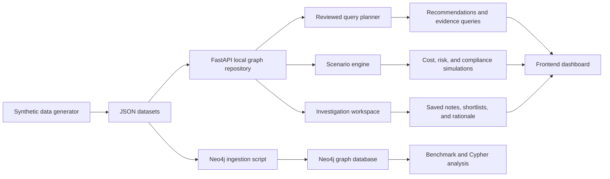

# PackGraph Lab

PackGraph Lab is a portfolio-safe, fully synthetic industrial knowledge graph demo for sustainable packaging materials intelligence. It models materials, suppliers, regulations, provenance documents, investigations, and quarterly operating changes so you can show how graph reasoning supports material selection and compliance work without relying on employer IP.

## Why this project exists

Packaging decisions are deeply connected: materials map to applications, applications map to industries and recycling streams, suppliers bring geography and disruption risk, and compliance depends on both evidence and timing. A graph model fits this naturally because the product questions are relationship-heavy:

- Which food-safe materials have the best sustainability profile?
- Which substitutes remain recyclable if a supplier fails?
- Which evidence documents support a compliance claim?
- What changes next quarter if a regulation becomes active?

PackGraph Lab demonstrates those flows with fresh branding, synthetic data, and a local-first developer experience.

## Feature set

- Synthetic data generator with correlated packaging-specific properties
- 75 materials, 25 suppliers, 20 applications, 12 regulations, 6 certifications, and 700+ relationships
- Provenance artifacts including fake datasheets, declarations, and lab reports
- Quarterly snapshots for price, risk, lead time, certification expiration, and compliance changes
- FastAPI backend with safe JSON endpoints
- Reviewed natural-language query planner instead of unconstrained Cypher generation
- Scenario simulator for supplier outages, cost jumps, sustainability reprioritization, and future regulation changes
- Investigation workspace with saved notes and shortlists
- Polished frontend with chat, material detail, compliance, provenance, graph, and timeline views
- Neo4j ingestion script with `MERGE`-based repeatable loading
- Optional Memgraph benchmark scaffold using the same dataset and query set

## Project structure

- `app/`: FastAPI app, repositories, and services
- `data/`: generated synthetic data and runtime outputs
- `docs/`: architecture notes
- `queries/`: example Cypher queries
- `scripts/`: dataset generation, graph ingestion, and benchmarking scripts
- `web/`: local frontend

## Local run

### Option 1: direct Python run

```bash
python -m venv .venv
.venv\Scripts\activate
pip install -r requirements.txt
python scripts/generate_data.py
uvicorn app.main:app --reload
```

Open [http://localhost:8000](http://localhost:8000).

### Option 2: Docker Compose

```bash
docker compose up
```

This starts Neo4j, the API, and an optional Memgraph service for benchmarking.

## Neo4j usage

Neo4j is the primary graph database target for full ingestion and portfolio demos.

1. Start Neo4j with Docker Compose or your own local instance.
2. Copy `.env.example` to `.env` if you want to override connection settings.
3. Run:

```bash
python scripts/ingest_graph.py
```

The script creates constraints, loads nodes with `MERGE`, and then creates relationships from the synthetic dataset.

## Memgraph benchmarking

Memgraph is optional and included as a comparison target rather than the primary runtime.

```bash
python scripts/benchmark_backends.py
```

The benchmark script records:

- backend reachability
- simple query latency comparison
- notes about planner and consistency differences

Results are written to `data/runtime/benchmark_results.json` and exposed by `/benchmarks`.

## Provenance design

Each material includes synthetic supporting evidence:

- datasheet-style records
- declaration-style records
- lab reports with barrier and seal outcomes
- supplier linkage and provenance scores

The API exposes this through `/materials/{id}` and the frontend surfaces it in the provenance explorer.

## Temporal and scenario reasoning

Quarterly snapshots capture:

- cost changes over time
- lead-time variation
- disruption risk movement
- certification expiration dates
- regulation watch references
- compliance score and state changes

Scenario endpoints simulate:

- supplier unavailability
- cost increases
- compostability-first ranking
- next-quarter regulation activation

## API overview

- `GET /materials`
- `GET /materials/{id}`
- `GET /suppliers`
- `GET /applications`
- `GET /investigations`
- `POST /investigations`
- `GET /query/recommendations`
- `POST /query/ask`
- `POST /query/scenario`
- `GET /runtime/backends`
- `GET /benchmarks`
- `GET /compliance/dashboard`
- `GET /graph/relationships`

## Workflow chart



## Example Cypher queries

See:

- [queries/recommend_food_materials.cypher](C:\Users\prana\OneDrive\Documents\Playground\packgraph-lab\queries\recommend_food_materials.cypher)
- [queries/trace_provenance.cypher](C:\Users\prana\OneDrive\Documents\Playground\packgraph-lab\queries\trace_provenance.cypher)
- [queries/risk_screen.cypher](C:\Users\prana\OneDrive\Documents\Playground\packgraph-lab\queries\risk_screen.cypher)

## Demo walkthroughs

### 1. Food packaging recommendation walkthrough

Ask the chat interface for food-safe materials or call `/query/recommendations?prioritize_sustainability=true`. Show how PackGraph Lab favors high barrier, recyclable, food-safe materials and explains the reviewed query route.

### 2. Provenance and compliance walkthrough

Select a material, open the provenance explorer, and trace supporting datasheets and lab reports. Pair this with the compliance dashboard to show how evidence and regulation status are connected.

### 3. Supplier disruption walkthrough

Trigger `/query/scenario` with a supplier-unavailable scenario and show how substitute materials and remaining supplier options change the decision path.

## Architecture notes

More detail lives in [docs/architecture.md](C:\Users\prana\OneDrive\Documents\Playground\packgraph-lab\docs\architecture.md).

## Portfolio talking points

- Relationship-rich packaging decisions benefit from graph modeling more than flat relational tables.
- Synthetic provenance and quarterly snapshots make the demo feel operational instead of static.
- Reviewed query planning is a safer story than open-ended Cypher generation.
- The project is intentionally local-first so reviewers can run it quickly.

## MVP to advanced roadmap

- Add real graph query execution against Neo4j-backed runtime endpoints
- Add user-authenticated investigation workspaces
- Add richer charting for temporal cost and compliance drift
- Add provenance diffing across document revisions
- Add multi-objective ranking with editable weights
- Add graph embeddings or vector retrieval for document-aware recommendations
