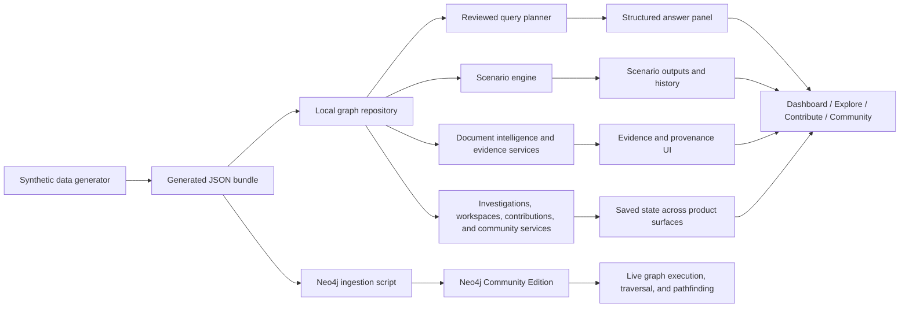

# PackGraph Lab

PackGraph Lab is a local-first product prototype for synthetic packaging intelligence. It is designed to show how a graph-native system can support material selection, supplier evaluation, compliance review, document evidence tracing, and scenario planning for packaging teams.

The project uses fully synthetic data, a FastAPI backend, a graph-oriented repository layer, optional Neo4j-backed execution, and a multi-surface frontend that behaves like a real product rather than a single demo screen.

## What the project is

PackGraph Lab models a packaging decision environment where materials, suppliers, applications, regulations, documents, certifications, recycling streams, regions, and quarterly operating snapshots are linked together.

Instead of treating each dataset as an isolated table, the product treats the decision as a connected graph. That makes it easier to answer questions like:

- Which food-safe materials are still viable if supplier risk increases?
- Which substitute materials preserve recyclability or compliance claims?
- Which documents support a material decision, and what evidence is still missing?
- What changes if a regulation activates next quarter?
- Which suppliers, certifications, and regional constraints affect a shortlist?

## Why this project exists

Packaging decisions are not single-variable decisions. A material can look strong on performance but fail on supplier concentration, certification coverage, regulatory timing, or evidence completeness. PackGraph Lab exists to demonstrate a more product-like way to navigate those tradeoffs:

- start with search and decision guidance
- move into comparison and evidence review
- inspect the graph around a candidate
- contribute new knowledge and discuss findings in context

## Product surfaces

The product is organized into four working modes.

### 1. Dashboard

The core decision workspace.

It currently includes:

- Overview surface for search, filtering, and structured answers
- Workbench surface for comparison, evidence review, exports, saved investigations, and scenarios
- Intelligence surface for graph inspection, node context, watchlists, trends, and timeline review

### 2. Explore

A browse-first research surface for opening materials, applications, suppliers, and related updates before asking graph questions.

It includes:

- tabbed entity browsing
- search and filtering
- selected-entity detail view
- saved searches
- jump-to-dashboard workflow

### 3. Contribute

A role-based contribution flow for submitting structured knowledge into the system.

It includes:

- contributor role cards
- role detail and permissions
- structured submission form
- review queue
- contribution status and recent activity

### 4. Community

A discussion layer for graph-aware conversation around materials, suppliers, regulations, sustainability, and sourcing signals.

It includes:

- channel browsing
- thread feed
- linked-material discussion context
- post creation
- thread detail and replies

## What is implemented right now

### Data and graph model

- Synthetic data generation for materials, suppliers, applications, regulations, certifications, documents, test reports, recycling streams, industries, regions, and quarterly snapshots
- Graph-oriented domain model with linked entities and 1,000+ generated relationships
- Local generated bundle used for immediate demo runtime
- Optional Neo4j Community Edition ingestion path with repeatable `MERGE`-based loading
- Optional Memgraph benchmark scaffold

### Backend

- FastAPI backend with endpoints for materials, suppliers, applications, investigations, recommendations, natural-language queries, scenarios, backend status, compliance, relationships, contributions, community, search, and supporting drilldowns
- Safe query-planning layer that uses reviewed intent routing instead of unconstrained Cypher generation
- Scenario engine for supplier outages, regulation activation, reformulation targets, and cost constraints
- Document intelligence support for uploaded evidence metadata and extracted field presentation
- Export support for PDF and CSV flows
- Workspace and investigation persistence using local runtime state

### Frontend

- Landing page with product overview, setup guidance, workflow framing, and entry links
- Dashboard with structured answer panel, comparison flow, evidence workspace, graph explorer, supplier and regulation drilldowns, trend panels, and timeline panels
- Light and dark theme support
- Explore, Contribute, and Community product sections
- Graph controls including presets, branch filters, zoom controls, path tracing, and interaction-focused graph context

## Core capabilities

- Search across materials, suppliers, regulations, documents, and reports
- Ask natural-language product questions through a reviewed planner
- Compare multiple materials with weighted ranking
- Inspect compliance pressure and supplier exposure
- Trace document evidence and extracted fields
- Save investigations and workspace context
- Run what-if scenarios and review scenario history
- Open node relationships and shortest paths in the graph explorer
- Review supplier and regulation detail panels
- Browse entity records before entering decision mode
- Submit structured contributions and review queues
- Discuss materials and sourcing topics in community threads

## Example product workflow

1. Open the landing page and jump into the product workspace.
2. Use Overview to search for a material family, supplier, or regulation.
3. Ask a focused question in the structured answer panel.
4. Move to Workbench if the answer produces a real shortlist.
5. Compare candidates, review evidence, and save the decision rationale.
6. Open Intelligence to inspect graph context around the selected material.
7. Run a scenario if the decision is sensitive to supplier outage, regulation timing, or cost.
8. Use Explore, Contribute, or Community as supporting product surfaces around the same graph context.

## Architecture summary

At a high level, the project works like this:



For more detail, see:

- [Architecture notes](C:\Users\prana\OneDrive\Documents\Playground\packgraph-lab\docs\architecture.md)
- [Repository map](C:\Users\prana\OneDrive\Documents\Playground\packgraph-lab\docs\repository-map.md)
- [Change tracking guide](C:\Users\prana\OneDrive\Documents\Playground\packgraph-lab\docs\changes\README.md)

## Repository structure

- `app/`
  FastAPI app, models, repositories, and services.
- `data/`
  Synthetic generated seed data plus local runtime files.
- `docs/`
  Architecture, repository guidance, and change-tracking notes.
- `queries/`
  Example Cypher query files.
- `scripts/`
  Data generation, ingestion, and benchmark scripts.
- `tests/`
  Automated backend-focused tests.
- `web/`
  Landing page, product HTML, frontend assets, and page modules.

## Local run

### Option 1: direct Python run

Use this when you want the fastest local developer workflow.

```bash
python -m venv .venv
.venv\Scripts\activate
pip install -r requirements.txt
copy .env.example .env
python scripts/generate_data.py
python scripts/ingest_graph.py
python -m uvicorn app.main:app --reload
```

Open:

- landing page: [http://127.0.0.1:8000/](http://127.0.0.1:8000/)
- product workspace: [http://127.0.0.1:8000/product](http://127.0.0.1:8000/product)

Notes:

- This path assumes Neo4j Community Edition is available at `bolt://localhost:7687` if you want live graph execution.
- If Neo4j is unavailable, the app can still fall back to the local JSON-backed repository for UI review and non-live demo flows.

### Option 2: Docker Compose

Use this when you want the project stack to start together.

```bash
docker compose up
```

This starts:

- Neo4j Community Edition
- the PackGraph API
- the synthetic dataset generation and ingestion flow
- the optional Memgraph benchmark target

## Runtime modes

### Local JSON-backed mode

Useful for:

- UI iteration
- demo review without a graph database
- frontend feature work
- local-first portfolio walkthroughs

### Neo4j-backed mode

Useful for:

- live graph traversal
- pathfinding
- relationship previews
- node context retrieval
- query-audit and plan-oriented graph behavior

When `GRAPH_BACKEND=neo4j`, the app writes graph query audit output to `data/runtime/neo4j_query_audit.jsonl`.

## Data model overview

The synthetic dataset includes:

- materials
- suppliers
- applications
- regulations
- certifications
- source documents
- test reports
- recycling streams
- regions
- industries
- quarterly snapshots

Typical relationship types include:

- `TARGETS_APPLICATION`
- `SUPPLIED_BY`
- `SUPPLIES`
- `HAS_DOCUMENT`
- `SUBSTITUTES_WITH`
- `RECYCLES_INTO`
- `REVIEWED_UNDER`

## Key API areas

### Product data

- `GET /materials`
- `GET /materials/{id}`
- `GET /suppliers`
- `GET /suppliers/{id}`
- `GET /applications`
- `GET /regulations`
- `GET /regulations/{id}`

### Decision support

- `GET /query/recommendations`
- `POST /query/ask`
- `POST /query/scenario`
- `GET /scenarios/history`
- `GET /compliance/dashboard`
- `GET /graph/relationships`

### Workspace and supporting product flows

- `GET /investigations`
- `POST /investigations`
- `GET /search/global`
- `GET /runtime/backends`
- `GET /benchmarks`

## Demo walkthroughs

### Recommendation walkthrough

Ask the workspace for food-safe recommendations and review the structured answer output. Then move into Workbench to compare the returned candidates.

### Evidence walkthrough

Select a material, inspect its provenance and extracted document fields, and use the compliance view to connect the material to supporting evidence and regulations.

### Scenario walkthrough

Run a supplier outage or regulation activation scenario and show how the projected impacts, actions, and scenario history change the decision path.

### Graph walkthrough

Open Intelligence, inspect a node, filter the graph by relationship type, and trace a shortest path between two connected entities.

## Example Cypher files

- [recommend_food_materials.cypher](C:\Users\prana\OneDrive\Documents\Playground\packgraph-lab\queries\recommend_food_materials.cypher)
- [trace_provenance.cypher](C:\Users\prana\OneDrive\Documents\Playground\packgraph-lab\queries\trace_provenance.cypher)
- [risk_screen.cypher](C:\Users\prana\OneDrive\Documents\Playground\packgraph-lab\queries\risk_screen.cypher)

## What makes this project interesting

- It treats packaging intelligence as a connected product problem, not just a dashboard problem.
- It uses synthetic but operational-feeling data so the workflow can be demonstrated safely.
- It separates reviewed query planning from freeform graph generation.
- It supports both local demo behavior and optional live graph execution.
- It includes not only a core workspace, but also research, contribution, and community surfaces around the same domain.

## Current limitations

- The dataset is synthetic and intended for product demonstration, not production decisioning.
- Some persistence flows are local runtime files rather than multi-user infrastructure.
- Neo4j-backed execution is present, but the system is still a prototype rather than a production deployment.
- Authentication and collaboration behaviors are product-like but not yet full enterprise-grade implementations.

## Roadmap direction

- Strengthen live Neo4j-backed runtime coverage across more product flows
- Expand document intelligence into richer extraction and evidence linking
- Improve multi-user auth, roles, and saved workspaces
- Increase drilldown depth for suppliers, regulations, and analytics
- Add stronger testing across ingestion, exports, graph flows, and scenario behavior
- Continue modularizing the frontend as the product surfaces grow

## Portfolio use

This project works well as a product-engineering portfolio piece because it demonstrates:

- domain modeling
- graph-oriented thinking
- multi-surface product design
- backend service composition
- local-first developer experience
- documentation and product framing
